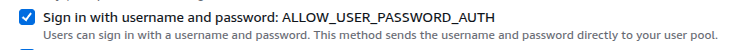

# Authentication using AWS Cognito in Next.js

### Prequisites

1. AWS Account.
2. Cognito User Pool.

---

### Packages needed

**1.** **@aws-sdk/client-cogito-identity-provider**

```
npm install @aws-sdk/client-cognito-identity-provider
```

The `@aws-sdk/client-cognito-identity-provider` is the AWS SDK v3 package for interacting with Amazon Cognito's Identity Provider service.

**2.** **axios**

```
npm install axios
```

`Axios` is a popular promise-based HTTP client for JavaScript that works in both browsers and Node.js.

**3.** **cookie**

```
npm install cookie
```

The `cookie` package lets you parse (read) and serialize (set) cookies in Node.js or Next.js server code.

**4.** **dotenv**

```
npm install dotenv
```

`dotenv` is a Node.js library that loads environment variables from a .env file into process.env.

**5.** **react-hook-form** (optional)

```
npm install react-hook-form
```

`react-hook-form` is a library for performant, flexible and extensible forms with easy-to-use validation.

---

## Create Cognito User Pool & App Client

Create a Cognito user pool using AWS Management Console.


Create App Client for this user pool.


For signup, the default is email and password, if you want to add some other attribute for eg. `Full Name`, then you will have to create a **custom attribute**. The syntax for this is `custom:fullName`.


There are many types of Authentication Flows in App Client settings, choose `USERNAME` & `PASSWORD` which is named as `ALLOW_USER_PASSWORD_AUTH`.



**Copy the values of `region`, `user-pool-id` & `app-client-id` in `env` file.**

```
AWS_REGION=ap-south-1
USER_POOL_ID=ap-south-1_xxxxxxxx
WEB_CLIENT_ID=xxxxxxxxxxxxxxxxxxxxxxxx
```

---

## Folder Structure

```
my-project/
    ├── app/
    │     ├── api/
    │     │    ├── signup/
    │     │    │    └── route.js
    │     │    ├── confirm-signup/
    │     │    │    └── route.js
    │     │    ├── resend-code/
    │     │    │    └── route.js
    │     │    ├── login/
    │     │    │    └── route.js
    │     │    ├── logout/
    │     │    │    └── route.js
    │     │    ├── auth-status/
    │     │    │    └── route.js
    │     ├── auth/
    │     │    └── page.js (auth page)
    │     ├── dashboard/
    │     │    └── page.js (dashboard page)
    │     ├── global.css
    │     ├── layout.js
    │     └── page.js (home page)
    ├── components/
    │     └── auth/
    │          ├── signup.js
    │          ├── login.js
    │          └── confirm-signup.js
    ├── context/
    │     └── auth-context.js
    ├── utils/
    │     └── cognito-config.js
    ├── .env
```

---

## Cognito Client Configuration

Now you have to configure cognito client so that you can call Cognito API using AWS Cognito SDK.

**`/utils/cognito-config.js`**

```jsx
import { CognitoIdentityProviderClient } from "@aws-sdk/client-cognito-identity-provider";

const cognitoClient = new CognitoIdentityProviderClient({
    region: process.env.AWS_REGION || "us-east-1",
});

export default cognitoClient;
```

---

## APIs Configuration

**1. Signup API**

**`/app/api/signup/route.js`**

```jsx
import { SignUpCommand } from "@aws-sdk/client-cognito-identity-provider";

import cognitoClient from "@/utils/cognito-config";

export const POST = async (req) => {
    // Grab inputs from frontend.

    const { fullName, email, password } = await req.json();

    // Input validation.

    const trimmedName = fullName.trim();
    const trimmedEmail = email.trim();
    const trimmedPassword = password.trim();

    if (!trimmedName || !trimmedEmail || !trimmedPassword) {
        return Response.json(
            { error: true, message: "All fields are required." },
            { status: 400 }
        );
    }

    const emailRegex = new RegExp(
        "^[a-zA-Z0-9._%+-]+@[a-zA-Z0-9.-]+\\.[a-zA-Z]{2,}$"
    );
    if (!emailRegex.test(trimmedEmail)) {
        return Response.json(
            { error: true, message: "Invalid email format." },
            { status: 400 }
        );
    }

    if (trimmedPassword.length < 6) {
        return Response.json(
            { error: true, message: "Password must be at least 6 characters." },
            { status: 400 }
        );
    }

    // Check whether cognito client is configured or not.

    const ClientId = process.env.WEB_CLIENT_ID;
    if (!ClientId) {
        return Response.json(
            { error: true, message: "Client ID is not configured." },
            { status: 500 }
        );
    }

    // Sign up the user in Cognito.

    try {
        const signupParams = {
            ClientId: ClientId,
            Username: trimmedEmail,
            Password: trimmedPassword,
            UserAttributes: [
                { Name: "email", Value: trimmedEmail },
                { Name: "custom:fullName", Value: trimmedName },
            ],
        };

        const command = new SignUpCommand(signupParams);
        const response = await cognitoClient.send(command);
        console.log(response);

        return Response.json(
            {
                error: false,
                message:
                    "User signed up successfully. Please check your email to verify your account.",
            },
            { status: 200 }
        );
    } catch (error) {
        if (error.name === "UsernameExistsException") {
            return Response.json(
                { error: true, message: "Email already exists." },
                { status: 400 }
            );
        }

        console.error("Sign up error:", error);
        return Response.json(
            {
                error: true,
                message:
                    error.message ||
                    "Failed to sign up user. Please try again.",
            },
            { status: 400 }
        );
    }
};
```

**2. Confirm Signup API**

**`/app/api/confirm-signup/route.js`**

```jsx
import { ConfirmSignUpCommand } from "@aws-sdk/client-cognito-identity-provider";

import cognitoClient from "@/utils/cognito-config";

export const POST = async (req) => {
    // Grab input from frontend.

    const { email, code } = await req.json();

    //Input Validation

    const trimmedEmail = email.trim();
    const trimmedCode = code.trim();

    if (!trimmedEmail || !trimmedCode) {
        return Response.json(**``**

            {
                error: true,
                message: "Email and verification code are required.",
            },
            { status: 400 }
        );
    }

    // Check whether cognito client is configured or not.

    const ClientId = process.env.WEB_CLIENT_ID;
    if (!ClientId) {
        return Response.json(
            { error: true, message: "Client ID is not configured." },
            { status: 500 }
        );
    }

    // Verify the user using OTP.

    try {
        const confirmSignupParams = {
            ClientId: ClientId,
            Username: trimmedEmail,
            ConfirmationCode: trimmedCode,
        };

        const command = new ConfirmSignUpCommand(confirmSignupParams);
        const response = await cognitoClient.send(command);
        console.log(response);

        return Response.json(
            {
                error: false,
                message: "Account verified successfully.",
            },
            { status: 200 }
        );
    } catch (error) {
        return Response.json(
            {
                error: true,
                message: error.message || "Account Verification Failed",
            },
            { status: 400 }
        );
    }
};

```

**3. Resend Verification Code API**

**`/app/api/resend-code/route.js`**

```jsx
import { ResendConfirmationCodeCommand } from "@aws-sdk/client-cognito-identity-provider";

import cognitoClient from "@/utils/cognito-config";

export const POST = async (req) => {
    // Grab email from frontend

    const { email } = await req.json();

    // Input Validation

    const trimmedEmail = email.trim();

    if (!trimmedEmail) {
        return Response.json(
            { error: true, message: "Email is required" },
            { status: 400 }
        );
    }

    // Check whether the cognito client is configured or not.

    const ClientId = process.env.WEB_CLIENT_ID;
    if (!ClientId) {
        return Response.json(
            { error: true, message: "Client ID is not configured." },
            { status: 500 }
        );
    }

    // Resend verification code on email address.

    try {
        const resendCodeParams = {
            ClientId: ClientId,
            Username: email,
        };

        const command = new ResendConfirmationCodeCommand(resendCodeParams);
        await cognitoClient.send(command);

        return Response.json(
            {
                error: false,
                message: "Resent verification code successfully.",
            },
            { status: 200 }
        );
    } catch (error) {
        return Response.json(
            {
                error: true,
                message: error.message || "Failed to resend verification code.",
                details: error.toString(),
            },
            { status: 400 }
        );
    }
};
```

**4. Login API**

**`/app/api/login/route.js`**

```jsx
import { InitiateAuthCommand } from "@aws-sdk/client-cognito-identity-provider";

import cognitoClient from "@/utils/cognito-config";

import { serialize } from "cookie";

export const POST = async (req) => {
    // Grab email and password from frontend

    const { email, password } = await req.json();

    // Input validation

    const trimmedEmail = email.trim();
    const trimmedPassword = password.trim();

    if (!trimmedEmail || !trimmedPassword) {
        return Response.json(
            { error: true, message: "All fields are required." },
            { status: 400 }
        );
    }

    if (trimmedPassword.length < 6) {
        return Response.json(
            {
                error: true,
                message: "Minimum password length should be 6 characters.",
            },
            { status: 400 }
        );
    }

    // Check the cognito client is configured or not.

    const ClientId = process.env.WEB_CLIENT_ID;
    if (!ClientId) {
        return Response.json(
            { error: true, message: "Client ID is not configured." },
            { status: 500 }
        );
    }

    // Login the user using email and password.

    try {
        const loginParams = {
            AuthFlow: "USER_PASSWORD_AUTH",
            ClientId: ClientId,
            AuthParameters: {
                USERNAME: trimmedEmail,
                PASSWORD: trimmedPassword,
            },
        };

        const command = new InitiateAuthCommand(loginParams);
        const response = await cognitoClient.send(command);
        console.log(response);

        const result = response?.AuthenticationResult;

        if (!result?.IdToken) {
            throw new Error("Authentication failed.");
        }

        const headers = new Headers();
        headers.append(
            "Set-Cookie",
            serialize("authToken", result.IdToken, {
                httpOnly: true,
                secure: process.env.NODE_ENV === "production",
                sameSite: "strict",
                maxAge: 60 * 60 * 24, // 1 day
                path: "/",
            })
        );

        return Response.json(
            {
                success: true,
                message: "Login Successful",
            },
            { status: 200, headers }
        );
    } catch (error) {
        return Response.json(
            {
                error: true,
                message:
                    error.message || "Login failed. Please try again later.",
                details: error.toString(),
            },
            { status: 400 }
        );
    }
};
```

**5. Logout API**

**`/app/api/logout/route.js`**

```jsx
import { serialize } from "cookie";

export const POST = async () => {
    return Response.json(
        { success: true, message: "Logged Out." },
        {
            status: 200,
            headers: {
                "Set-Cookie": serialize("authToken", "", {
                    httpOnly: true,
                    secure: process.env.NODE_ENV === "production",
                    sameSite: "strict",
                    maxAge: 0,
                    path: "/",
                }),
            },
        }
    );
};
```

**6. Authenticatioon Status API**

**`/app/api/auth-status/route.js`**

```jsx
import { cookies } from "next/headers";

import { GetUserCommand } from "@aws-sdk/client-cognito-identity-provider";

import cognitoClient from "@/utils/cognito-config";

export const GET = async (req) => {
    try {
        const token = (await cookies()).get("authToken")?.value;

        if (!token) {
            return Response.json(
                { user: null, message: "Not Authenticated" },
                { status: 401 }
            );
        }

        const command = new GetUserCommand({ AccessToken: token });
        const response = await cognitoClient.send(command);

        return Response.json(
            { user: response, message: "Authenticated" },
            { status: 200 }
        );
    } catch (error) {
        console.error("Auth check error", error);
        return Response.json(
            { user: null, message: "Invalid Token" },
            { status: 401 }
        );
    }
};
```

---

## Building Pages

**1. Authentication Page**

Here we are not going to use different pages for signup and login because the page rendering takes time, so we will use different components for login, signup and confirm-signup on a single page.

For achieving this, we are going to use query parameter `mode`. For eg.

If `/auth?mode=signup` then signup component will be rendered on Auth page.

If `/auth?mode=login` then login component will be rendered on Auth page.

If `/auth?mode=confirm-signup` then confirm-signup component will be rendered on Auth page.

So before creating theAuth Page, you need to create these components.

### Components Configuration

**1. Signup Component**

`/components/auth/signup.js`

```jsx
"use client";

import { useForm } from "react-hook-form";

import { useRouter } from "next/navigation";

import { useState } from "react";

import axios from "axios";

const Signup = () => {
    const [apiError, setApiError] = useState("");

    const router = useRouter();

    const {
        register,
        handleSubmit,
        formState: { errors },
    } = useForm();

    // Signup form submission handler

    const onSignup = async (data) => {
        setApiError("");
        try {
            const response = await axios.post("/api/signup", data);
            console.log(response);

            if (response.data.error) {
                setApiError(response.data.error);
                return;
            }

            router.push(
                `/auth?mode=confirm-signup&email=${encodeURIComponent(
                    data.email
                )}`
            );
        } catch (error) {
            setApiError(
                error.response?.data?.message ||
                    "An error occurred during signup."
            );
        }
    };

    return (
        <form onSubmit={handleSubmit(onSignup)}>
            <input
                {...register("fullName", {
                    required: "Full name is required.",
                })}
                placeholder="Full Name"
            />
            {errors.fullName && <p>{errors.fullName.message}</p>}
            <br />
            <input
                {...register("email", {
                    required: "Email is required.",
                })}
                type="email"
                placeholder="Email Address"
            />
            {errors.email && <p>{errors.email.message}</p>}
            <br />
            <input
                {...register("password", {
                    required: "Password is required.",
                })}
                type="password"
                placeholder="********"
            />
            {errors.password && <p>{errors.password.message}</p>}
            <br />
            {apiError && <p>{apiError}</p>}
            <button type="submit">Signup</button>
        </form>
    );
};

export default Signup;
```

**2. Confirm Signup Component**

`/components/auth/confirm-signup.js`

```jsx
"use client";

import { useForm } from "react-hook-form";

import { useRouter, useSearchParams } from "next/navigation";

import { useState } from "react";

import axios from "axios";

const ConfirmSignup = () => {
    const [apiError, setApiError] = useState("");

    const [apiMessage, setApiMessage] = useState("");

    const router = useRouter();

    const email = useSearchParams().get("email");

    const {
        register,
        handleSubmit,
        formState: { errors },
    } = useForm();

    const onConfirmSignup = async (data) => {
        setApiError("");
        setApiMessage("");
        try {
            const response = await axios.post("/api/confirm-signup", {
                email,
                code: data.code,
            });
            console.log(response);

            if (response.data.error) {
                setApiError(response.data.error);
                return;
            }

            router.push("/auth?mode=login");
        } catch (error) {
            console.log(error);
            setApiError(error.response?.data?.message);
        }
    };

    const handleResendCode = async (data) => {
        setApiError("");
        setApiMessage("");
        try {
            const response = await axios.post("/api/resend-code", {
                email,
            });
            console.log(response);

            if (response.data.error) {
                setApiError(response.data.error);
                return;
            }

            setApiMessage("Verification code resent successfully.");
        } catch (error) {
            console.log(error);
            setApiError(error.response.data.error);
        }
    };

    return (
        <form onSubmit={handleSubmit(onConfirmSignup)}>
            <h2>Verify your Email Address</h2>
            <p>
                We&apos;ve sent a 6-digit verification code to{" "}
                <strong>{email}</strong>. <br /> Please enter the code below to
                verify your account.
            </p>
            <input
                {...register("code", {
                    required: "Code is required",
                })}
                type="number"
                placeholder="Verification Code"
            />
            {errors.code && <p>{errors.code.message}</p>}
            <br />
            <button type="button" onClick={handleResendCode}>
                Resend
            </button>
            <button type="submit">Verify</button>

            {apiError && <p>{apiError}</p>}
            {apiMessage && <p>{apiMessage}</p>}
        </form>
    );
};

export default ConfirmSignup;
```

Now for `login` and `logout`, the whole webiste must know that whether the user is logged-in or logged-out. So we will use Context Api for this purpose.

So you will have to create a context file named as `auth-context.js`, which will check the authentication status of the user.

## Auth Context

`/context/auth-context.js`

```jsx
"use client";

import {
    createContext,
    useState,
    useCallback,
    useEffect,
    useContext,
} from "react";

import axios from "axios";

import { useRouter } from "next/navigation";

const AuthContext = createContext({
    user: null,
    loading: true,
    login: () => {},
    logout: () => {},
});

export const AuthProvider = ({ children }) => {
    const [user, setUser] = useState(null);

    const [loading, setLoading] = useState(true);

    const router = useRouter();

    const checkAuthStatus = useCallback(async () => {
        try {
            const response = await axios.get("/api/auth-status", {
                withCredentials: true,
            });
            setUser(response.data.user || null);
        } catch {
            setUser(null);
        } finally {
            setLoading(false);
        }
    }, []);

    useEffect(() => {
        checkAuthStatus();
    }, [checkAuthStatus]);

    const login = (userData) => {
        setUser(userData);
    };
    const logout = async () => {
        try {
            await axios.post("/api/logout", {}, { withCredentials: true });
            setUser(null);
            router.push("/auth?mode=login");
        } catch (error) {
            console.error("Logout failed:", error);
        }
    };

    return (
        <AuthContext.Provider value={{ user, loading, login, logout }}>
            {children}
        </AuthContext.Provider>
    );
};

export const useAuth = () => {
    const context = useContext(AuthContext);
    if (!context) {
        throw new Error("useAuth must be used within an AuthProvider");
    }
    return context;
};
```

**3. Login Component**

`/components/auth/login.js`

```jsx
"use client";

import { useForm } from "react-hook-form";
import axios from "axios";
import { useRouter } from "next/navigation";
import { useAuth } from "@/context/auth-context";
import { useEffect } from "react";

const Login = () => {
    const router = useRouter();

    const { user, login } = useAuth();

    const {
        register,
        handleSubmit,
        formState: { errors },
    } = useForm();

    useEffect(() => {
        if (user) router.push("/dashboard");
    }, [user, router]);

    const onSubmit = async (data) => {
        try {
            const response = await axios.post("/api/login", data, {
                withCredentials: true,
                headers: {
                    "Content-Type": "application/json",
                },
            });

            if (response.data?.user) {
                login(response.data.user);
                console.log("go to dashboard");
                router.push("/dashboard");
            } else {
                throw new Error(response.data?.message || "Login failed");
            }
        } catch (err) {
            alert(err.response?.data?.message || err.message);
        }
    };

    return (
        <form onSubmit={handleSubmit(onSubmit)}>
            <input
                type="email"
                placeholder="Email"
                {...register("email", { required: "Email is required" })}
            />
            {errors.email && <p>{errors.email.message}</p>}

            <input
                type="password"
                placeholder="Password"
                {...register("password", { required: "Password is required" })}
            />
            {errors.password && <p>{errors.password.message}</p>}

            <button type="submit">Login</button>
        </form>
    );
};

export default Login;
```

Create a dashboard page. When the user is logged-in successfully, redirect the user to dashboard page. Also make sure the dashboard page is only accessible when a user is logged-in, so use protected routes for this.

## Authentication Page

`/app/auth/page.js`

The default mode is `Login`. So the url will be `/auth?mode=login`

```jsx
"use client";

import { useSearchParams } from "next/navigation";

import Signup from "@/components/auth/signup";
import ConfirmSignup from "@/components/auth/confirm-signup";
import Login from "@/components/auth/login";

const AuthPage = () => {
    const mode = useSearchParams().get("mode");

    return (
        <div>
            <h1>Auth Page</h1>
            {mode === "signup" && <Signup />}
            {mode === "login" && <Login />}
            {mode === "confirm-signup" && <ConfirmSignup />}
        </div>
    );
};

export default AuthPage;
```

---

**Now you have successfully built authentication in Next.js App using AWS Cognito.**
