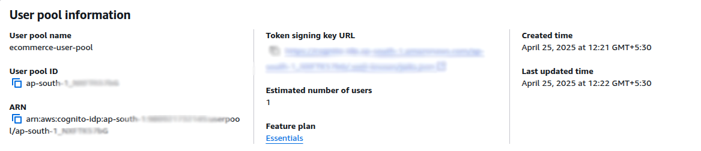
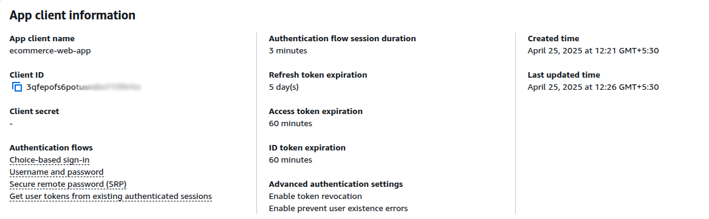
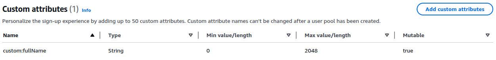
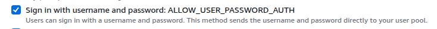

# Authentication using AWS Cognito in Next.js

### Prequisites

1. AWS Account.
2. Cognito User Pool.

---

### Packages needed

**1.** **@aws-sdk/client-cogito-identity-provider**

```
npm install @aws-sdk/client-cognito-identity-provider
```

The `@aws-sdk/client-cognito-identity-provider` is the AWS SDK v3 package for interacting with Amazon Cognito's Identity Provider service.

**2.** **axios**

```
npm install axios
```

`Axios` is a popular promise-based HTTP client for JavaScript that works in both browsers and Node.js.

**3.** **cookie**

```
npm install cookie
```

The `cookie` package lets you parse (read) and serialize (set) cookies in Node.js or Next.js server code.

**4.** **dotenv**

```
npm install dotenv
```

`dotenv` is a Node.js library that loads environment variables from a .env file into process.env.

**5.** **react-hook-form** (optional)

```
npm install react-hook-form
```

`react-hook-form` is a library for performant, flexible and extensible forms with easy-to-use validation.

---

## Create Cognito User Pool & App Client

Create a Cognito user pool using AWS Management Console.



Create App Client for this user pool.



For signup, the default is email and password, if you want to add some other attribute for eg. `Full Name`, then you will have to create a **custom attribute**. The syntax for this is `custom:fullName`.



There are many types of Authentication Flows in App Client settings, choose `USERNAME` & `PASSWORD` which is named as `ALLOW_USER_PASSWORD_AUTH`.



**Copy the values of `region`, `user-pool-id` & `app-client-id` in `env` file.**

```
AWS_REGION=ap-south-1
USER_POOL_ID=ap-south-1_xxxxxxxx
WEB_CLIENT_ID=xxxxxxxxxxxxxxxxxxxxxxxx
```

---

## Folder Structure └── ├── │

```
my-project/
    ├── app
    ├── components
    ├── context
    ├── utils
    ├── .env
```
